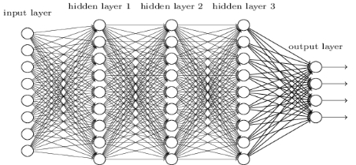

## 4.7 CcxDNN

#### CcxDNN算法原理

​	深度神经网络（DNN）是将多层前馈神经网络扩展到深度学习中，内部神经网络分为输入层、隐藏层和输出层三类。但从局部模型来讲，与感知机原理类似，即一个线性关系，再经过激活函数得到对应神经元的输出。如下图的形式所示：

​	我们假设第层共有m个神经元，则对于第层的第j个神经元的输出有：；采用矩阵法表示第层的输出，假设第层的权重系数组成为一个的矩阵，第层的偏置为一个的向量，第层的输出为一个的向量，那么第层的输出为一个的向量，用矩阵法表示第层的输出为：

算法输入为：神经网络总层数L，隐含层与输出层的神经元个数，激活函数，损失函数，m个训练样本数据，以及最大迭代次数max；输出为：各隐含层与输出层的系数矩阵和偏置向量。

1）随机初始化各隐含层和输出层的系数矩阵和偏置向量

2）for iter=1 to max：

​	for i=1 to m：

​		a）将DNN输入作为

​		b）for=2 to L，进行前向传播算法计算： 

​		c）通过损失函数计算输出层的

​		d）for =L-1 to 2，进行反向传播算法计算： 

​	for =2 to L，更新第层的：

​								，

如果所有的变化值都小于停止迭代阈值，则跳出循环到步骤3

3）输出各隐含层与输出层的系数矩阵和偏置向量。

#### CcxDNN模型超参数设置

- **数据划分**：系统提供了分层抽样和随机抽样两种数据划分方法；

- **测试集比例**：用于分配模型训练中训练样本与测试样本的比例；

- **neuron_num**：万象智模平台默认使用的神经元个数128,64,32,6。

- **feed_time**：万象智模平台默认值50，算法的迭代次数，即训练集全部数据对模型进行一次完整训练的次数。

- **keep_prob**：万象智模平台默认值0.7，它是所有神经元被保留的概率，取值范围为[0，1]。一般神经网络在大量数据训练时，为了防止过拟合，会通过添加dropout层设置keep_prob让部分神经元失活，减少冗余信息，提升模型的泛化能力。

- **cross_entropy**：万象智模平台提供了softmax、weight、sparse_cross_entropy和sigmoid四种交叉熵损失函数，对不同的应用场景应选择合适的交叉熵函数。

- **optimizer**：万象智模平台提供了Adam、Gradient Descent、Adadelta、RMSprop和Momentum五种优化方法来寻找模型的最优解。如果数据是稀疏的，就用自适应方法，即Adadelta、RMSprop和Adam，在很多情况下的效果是相似的。随着梯度变稀疏，Adam比RMSprop效果好，总体来说Adam是较好的选择。

- **inspirit_function**：万象智模平台提供了tanh、softmax、sigmoid、relu和softplus五种不同的神经元激活函数，将非线性特性引入到神经网络中，提高了神经网络模型对于复杂问题的表达能力。

- **寻优策略**

  - **init_points**：万象智模平台默认值2，确定寻优方式后，算法对应的模型超参数组合的初始个数。

  - **num_iter**：万象智模平台默认值5，寻优算法的迭代次数。

- **最优选择指标**

  - **测试集auc最优**：最优模型为测试集上模型评估指标auc最大的模型。

  - **测试集/训练集auc综合最优**：最优模型为综合测试集和训练集上模型评估指标auc最大的模型。