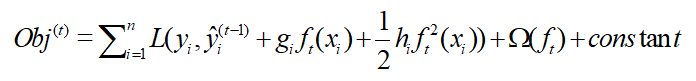

## 4.3 CcxXgBoost

#### CcxXgBoost算法原理

​	CcxXgBoost是基于Gradient Boosting Decision Tree算法进行扩展和改进的算法。XgBoost在损失函数中加入正则项，能够减少过拟合，且采用二阶泰勒展开求解损失函数的最优解，使得计算速度和准确率上相比GBDT均有所提升。XgBoost目标函数的定义：

​	其中，为label值，为预测输出，为第t个树模型，为常数项；表示树的复杂深度，一种定义方法是使用叶节点总数和叶权值平方和的加权：，为树叶子节点数，为叶子权重值，为叶子惩罚正则项，具有剪枝作用。为叶子权重惩罚正则项，防止过拟合。

​	用二阶泰勒展开近似目标函数：

​	其中，，，最终的目标函数只依赖于每个数据点在误差函数上的一阶导数和二阶导数。求出使得损失函数最小的树结构：

模型，XgBoost最终模型可以表示为：

#### CcxXgBoost使用建议

​	CcxXgBoost算法相比传统GBDT算法在计算速度和准确率上有明显的提升，根据算法原理和实践经验提出如下使用建议：

- 对于高维度高样本量的数据集，采用XgBoost算法能够得到较好的效果。

- 选择较高的学习率(eta)，一般情况下，学习率的值为0.1。但是，对于不同的问题，理想的学习率有时候会在0.05到0.3之间波动，还应选择对应此学习率的理想决策树数量进行模型训练。

- 对于给定的学习速率和决策树数量，进行决策树特定参数调优(max_depth, min_child_weight，gamma，subsample，colsample_bytree)。在确定一棵树的过程中，我们可以通过选择不同的参数，训练得到更好的模型。

- XgBoost正则化参数的调优，调整lambda参数可以降低模型的复杂度，从而提高模型的表现。

- 可以降低学习率以及使用更多的决策树，多次迭代从而确定模型超参数。

#### CcxXgBoost模型超参数设置

- **数据划分**：系统提供了分层抽样和随机抽样两种数据划分方法

- **测试集比例**：用于分配模型训练中训练样本与测试样本的比例

- **num_round**：万象智模平台默认值500，即最大的迭代次数或轮数，也就是需要使用到的决策树的数量，取值太小容易欠拟合，取值太大，计算量会太大，而且虽然算法在较多决策树时仍能保持稳健，但可能会发生过拟合，同时需要和参数learing_rate进行同步设置，采用交叉验证CV进行检验。

- **eta**：万象智模平台默认值0.3，取值范围[0，1]，建议取值0.01-0.3。学习率通过减少每一步的权重，可以提高模型的鲁棒性。

- **max_depth**：万象智模平台默认值4，建议取值3-10，树的最大深度取值越大，对数据集的拟合效果越好，但也会使模型学到更具体更局部的样本，导致出现过拟合。

- **subsample**：万象智模平台默认值0.5，建议取值0.5-1，用于控制每棵树随机采样的子样本占整个集合样本的比例，比例小，容易导致欠拟合，比例大，容易导致过拟合。

- **colsample_bytree** ：万象智模平台默认值0.8，建议取值0.5-1，控制每棵树随机采样的列数占比（每一列是一个特征）。

- **min_child_weight**：万象智模平台默认值2，建议取值1-100。最小叶子结点样本权重是控制过拟合的参数之一，值较大时，模型过于保守，即导致欠拟合，值较小时，模型会过拟合，需要通过交叉验证调整。

- **gamma**：万象智模平台默认值2，结点分裂所需的最小损失函数下降值，值越大，算法越保守。

- **lambda**：万象智模平台默认值1000，L2正则化项的权重，可以控制模型复杂度，防止过拟合。lambda取值越大，模型越保守。

- **scale_pos_weight**：万象智模平台默认值1，通过增加正样本标签的权重来处理不平衡的问题，在各类别样本十分不平衡时，如果这个参数取值大于0，设置为正数时，则有助于算法快速收敛。

- **寻优策略**

  - **init_points**：万象智模平台默认值为2，确定寻优方式后，算法对应的模型超参数组合的初始个数。

  - **num_iter**：万象智模平台默认值为5，寻优算法的迭代次数。

- **最优选择指标**

  - **测试集auc最优**：最优模型选择标准为测试集上模型的评估指标auc最大。

  - **测试集/训练集auc综合最优**：最优模型选择标准为综合测试集和训练集上模型的评估指标auc最大。

