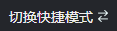

## 3.1 平台登录

​	AIMS平台浏览器兼容：IE11、360、火狐、Chrome等，推荐使用Chrome，系统的登录界面如下图所示。

图3.1 AIMS平台登录界面

系统为用户提供了快捷模式和标准模式系统为用户提供了快捷模式和标准模式的两种不同操作方式，其操作界面分别如下图所示。用户登录系统后，默认显示为快捷模式，可通过点击页面右上角红色标注的按钮，实现两种模式之间的相互切换；点击按钮，可进入用户个人中心实现修改密码和退出的功能；点击按钮，可查阅平台的使用说明帮助文档，其中包含平台简介、操作指引、算法介绍以及实际案例等详细操作介绍。

​	快捷模式，简明之意即能够帮助用户快速、方便的实现业务需求的建模部署应用，它简化、封装了部分建模过程，使得在保证模型性能要求的前提下，对于建模速度得到了极大的提升。

图3.2 快捷模式操作界面

标准模式则为用户提供了一套完整的建模流程，从开始的数据分析、入模变量筛选，再到模型训练超参数设置、模型预测，最后到模型部署应用以及平台的其他功能等，用户能够详细了解到每个流程的模型信息，可以结合自身业务需求进行不断调整，得到最佳的预测模型。

图3.3 标准模式操作界面
