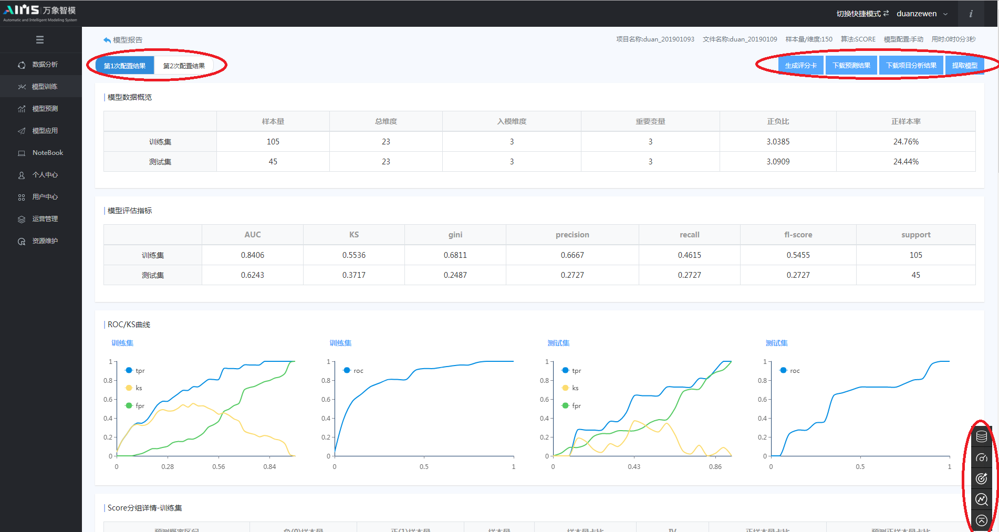

### 3.3.2 模型训练

模型训练模块主要提供训练项目创建、模型效果评估等功能。

​	（1）项目创建

​	用户创建一个模型训练项目，需要进行如下操作设置：1、项目名称输入，同时下拉菜单选项选择训练数据文件；2、算法选择，目前平台支持CcxScorecard 、CcxXgboost、CcxRF、CcxGBM、CcxAdaboost、CcxGBDT、CcxDNN等7种算法，算法选择只能单选；3、模型配置：系统提供自动/手动两种配置模式，以及特征工程（选填/单选）、寻优方式（单选）、算法配置（单选）等三个模型组件。其中，手动模式是面向专业人士的模型参数配置页面，除上述组件外还为用户提供了数据划分（单选）、测试集比例划分、模型超参数设置、寻优策略和最优选择指标（单选）五个模型组件。（具体模型超参数配置请参考第四章相关算法原理及使用说明）

​	具体操作界面如图3.19-3.20所示。下图中红色区域标注为模型的训练日志，用户可点击查看模型在训练过程的一些具体信息。

图3.19 项目创建操作界面

图3.20 模型算法配置界面

​	用户完成上述配置后，点击项目创建中的开始按钮，系统将开始进行模型训练，可点击项目列表栏后的日历图标选项进行实时的日志查看。

​	（2）模型评估

​	模型训练结束后，系统会自动生成分箱结果/调参报告、模型报告等性能评估文件，用户可点击进入页面进行查看。此处以CcxScoreCard算法评分卡模型（手动模式）为例，对算法参数配置完成后，点击下方开始按钮随即可生成分箱结果，它为用户提供了各变量的分箱详情与入模建议信息，如图3.21所示。用户可根据建议信息对入模变量进行调整，然后再次点击下方开始按钮进入模型训练过程，最终生成的模型报告和调参报告如图3.22所示。若模型初期训练效果不满足要求，则可在调参报告中对模型参数重新进行调整，经过多次重复训练以得到理想的模型效果。模型报告、分箱结果和二次调参报告生成位置如下图红色区域标注所示。

图3.21 模型调参报告页面

图3.22 模型报告显示页面

​	页面左上角红色标注记录为模型不同参数配置后的模型结果，右下角为显示小助手，可以快速切换显示不同的模型指标；模型报告中主要展示了项目信息、模型数据概览、模型评估指标和重要变量等相关信息，用户可在页面右上角下载相关预测结果以及项目分析结果，点击生成评分卡按钮，在通过设置参数basescore（特定比率的预期分值）和PDO（比率翻番的分数）后，系统将自动生成逻辑回归算法评分卡。在模型效果满足要求后，点击模型提取将模型由训练模块直接提取至模型预测模块。