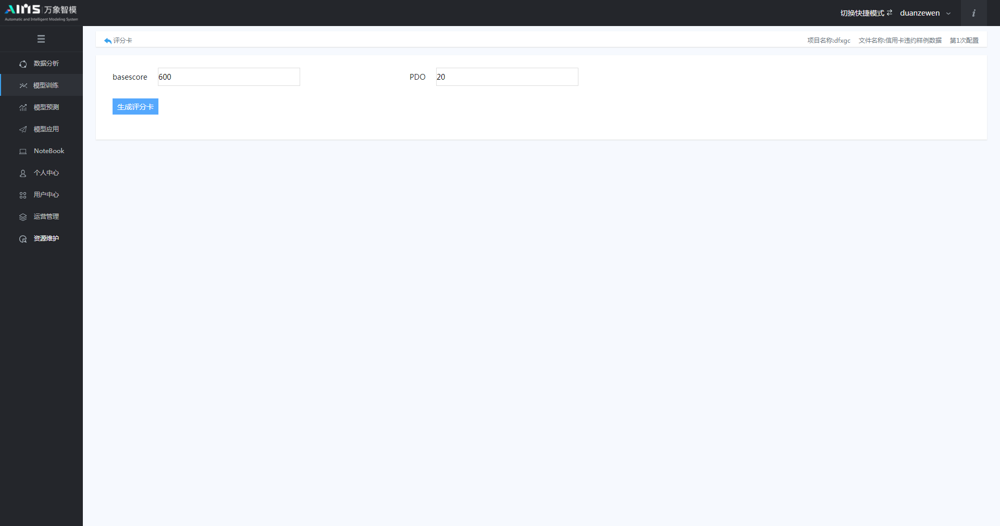
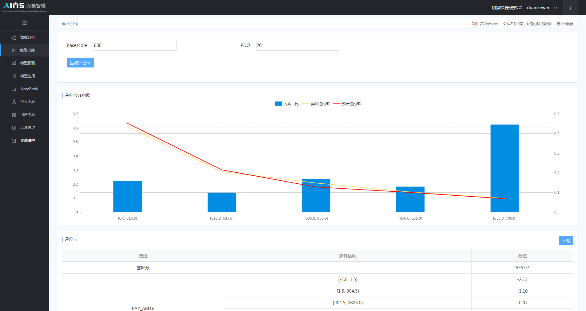
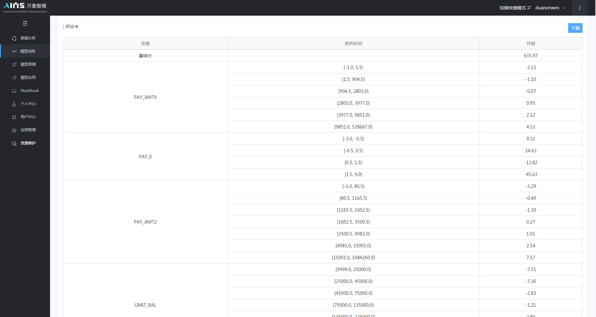

## 5.3 模型训练

​	对数据文件基本信息深入了解后，我们就可以用AIMS平台建立一个模型，点击模型训练按钮进行模型的训练。这里我们采用CcxXgBoost算法建立模型，模型配置选择为自动模式；特征工程选择算法衍生，寻优方式采用网格搜索，算法配置选择演示；配置完成后点击开始按钮，即可进入模型训练过程，等待模型训练完成。其中，AIMS平台对运行的模型记录了详细的日志信息供用户查看，可以通过点击图示的按钮来查看训练过程中的详细信息。本例中日志如下图5.8所示：

图5.8 模型训练的日志信息

​	AIMS智能建模团队通过对算法不断的进行探索与优化，已极大的提升了模型的训练效率和准确率。在本例中，整个模型训练的过程仅用时12秒，其中分别包括了数据集划分，5折交叉验证，超参数网格寻优，模型建立，模型比较与选择，模型评价指标计算，最终结果保存与输出。

​	当模型训练完毕后，点击“模型报告”按钮，即可看到详细的模型输出报告。其中包括了：模型数据概览、模型评估指标、ROC/KS曲线、概率分组详情、概率分箱图、TOP20变量分析图、变量重要性排序/变量统计指标。详细信息见下图5.9-5.11所示：

图5.9 模型数据概览、评估指标和ROC/KS曲线

图5.10 模型概率分组和概率分箱详情

图5.11 模型变量分析以及重要性排序

​	在模型效果满足要求后，用户可点击模型提取按钮，将模型由训练模块直接提取至模型预测模块。对于CcxScoreCard评分卡模型，可点击图5.12中的生成评分卡选项生成评分卡，进入如图5.13所示的参数设置页面。

图5.12模型数据概览、评估指标和ROC/KS曲线

图5.13 生成评分参数设置

用户设置basescore（特定比率的预期分值）和PDO（比率翻番的分数）后，再次点击生成评分卡按钮，系统将自动生成逻辑回归算法评分卡，如图5.14-5.15所示，用户可在页面右上角进行评分卡的下载。

图5.14 评分卡分布图

5.15 评分卡页面

