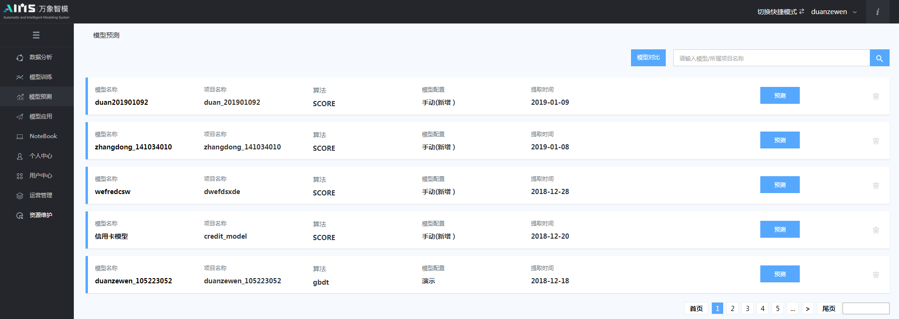
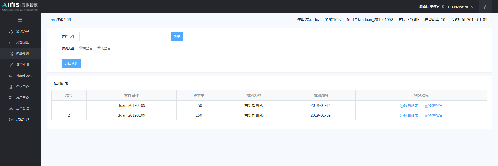

## 5.4 模型预测

在模型训练完成后，我们可以利用平台提供的模型对比功能，同时进行多个模型的性能指标对比分析，选择最佳模型进行在线数据样本的预测。模型预测具体过程如下图5.16-5.17所示。

图5.16 模型预测界面

进入模型预测页面后，用户可选择要上传的预测数据文件（数据文件应与建模数据格式一致）；设置预测类型，分别有监督、无监督两种预测类型。点击开始预测按钮后，列表将中自动添加本次预测记录；在预测完成后，用户可查看预测结果及相应的预测报告。

图5.17 模型预测结束界面

图5.18 模型预测结果

图5.19 模型预测报告

