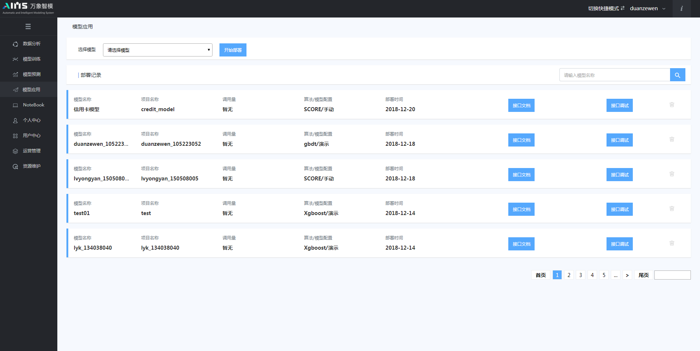
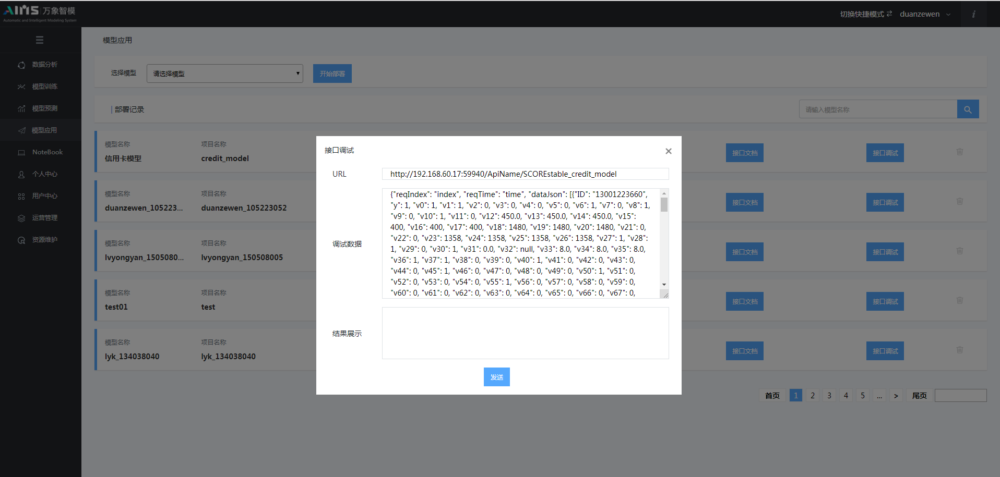

## 5.5 模型部署

在我们训练好模型之后，当模型精确程度达到了我们的预期，最终我们将采用线上一键部署的方式，将模型部署到后台服务器，系统将返回模型调用接口文档以及接口调试窗口，包括接口的URL和模型参数，如图5.20所示。接口调试以API接口的形式，进行实时的计算，并返回预测结果。其中，接口支持单条形式，也支持批量形式，接口调试界面如图5.21所示。

图5.20 模型部署界面

图5.21 接口调试界面

